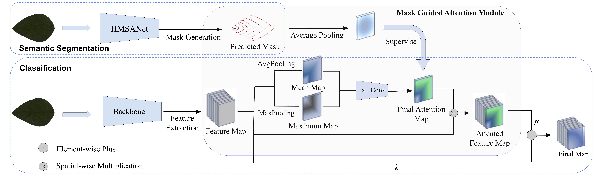

# MASK GUIDED ATTENTION FOR FINE-GRAINED PATCHY IMAGE CLASSIFICATION

PyTorch implementation of 

[MASK GUIDED ATTENTION FOR FINE-GRAINED PATCHY IMAGE CLASSIFICATION](https://https://arxiv.org/pdf/2102.02771.pdf)" ( ICIP 2021 ) 

If you use the code in this repo for your work, please cite the following bib entries:

    @article{wang2021mask,
        title={Mask guided attention for fine-grained patchy image classification},
        author={Wang, Jun and Yu, Xiaohan and Gao, Yongsheng},
        journal={arXiv preprint arXiv:2102.02771},
        eprint={2003.06777v3},
        archivePrefix={arXiv},
        primaryClass={cs.CV}
    }

## Abstract

In this work, we present a novel mask guided attention (MGA) method for fine-grained patchy image classification. The key challenge of fine-grained patchy image classification lies in two folds, ultra-fine-grained inter-category variances among objects and very few data available for training. This motivates us to consider employing more useful supervision signal to train a discriminative model within limited training samples. Specifically, the proposed MGA integrates a pre-trained semantic segmentation model that produces auxiliary supervision signal, i.e., patchy attention mask, enabling a discriminative representation learning. The patchy attention mask drives the classifier to filter out the insignificant parts of images (e.g., common features between different categories), which enhances the robustness of MGA for the fine-grained patchy image classification. We verify the effectiveness of our method on three publicly available patchy image datasets. Experimental results demonstrate that our MGA method achieves superior performance on three datasets compared with the state-of-the-art methods. In addition, our ablation study shows that MGA improves the accuracy by 2.25% and 2% on the SoyCultivarVein and BtfPIS datasets, indicating its practicality towards solving the fine-grained patchy image classification.

## Prerequisites

The following packages are required to run the scripts:
- [Python >= 3.6]
- [PyTorch >= 1.0]
- [Torchvision]

## Dataset
The dataset will be released after we complete the code refactoring.

## Training scripts for MGANet with the backbone network Densenet161.
Train the model on the Soybean dataset

    $ python train.py -dataset soybean -lr 0.05 -backbone_class densenet161

## Testing scripts for MGANet with the backbone network Densenet161.
Test the model on the Soybean dataset:

    $ python test.py  -dataset soybean -backbone_class densenet161
    
        
            
## Download  Models

[Trained model Google Drive](https://drive.google.com/drive/folders/1ZoG0yOyOaLd3Fgv4ImvNxATeO3pek3VG?usp=sharing)

## Acknowledgment
Thanks for the advice and guidance given by Dr.Xiaohan Yu and Prof. Yongsheng Gao.

Our project references the codes in the following repos.
- [pytorch-cifar](https://github.com/kuangliu/pytorch-cifar)

